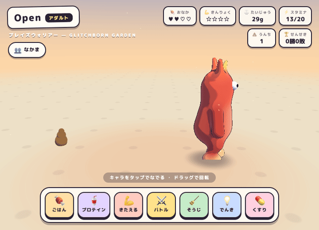

# 🥚 グリッチボーン ガーデン — GLITCHBORN GARDEN

ブラウザで遊べる3D育成バトルゲーム。インストール不要、サーバー不要。

**▶ 遊ぶ: https://heroofchickens.github.io/glitchborn-garden/**

## 遊び方

- 🥚 タマゴをむかえて名前をつける（5分で孵化）
- 🍖 じかんが たつと おなかが へる。ごはんをあげよう
- 💪 「きたえる」はタイミングミニゲーム。きんりょくが上がる
- ⚔️ チャイルド以降はバトルできる。3すくみ（ブレイズ＞シャドウ＞ゲイル＞ブレイズ）
- 💩 うんちを放置すると病気になる。そうじを忘れずに
- ❗ 世話コールを20分放置すると「育成ミス」。ミスが多いと…進化先が変わる
- 🌙 でんきを消すと寝る。スタミナ全回復
- 👥 なかまは何匹でも。死んだ子のお墓参りもできる

## しくみ

- キャラクターは全部プロシージャル生成（three.js・画像アセットなし）。折り紙・墨絵・粘土・スライム・切り絵・トゥーンSDFの十様式
- 効果音もWebAudioシンセ生成（音声ファイルなし）
- セーブデータはブラウザのlocalStorage。時間経過は決定論的Tick（閉じてる間もちゃんとおなかが減る）

---

Built with [Claude Code](https://claude.com/claude-code) 🤖
